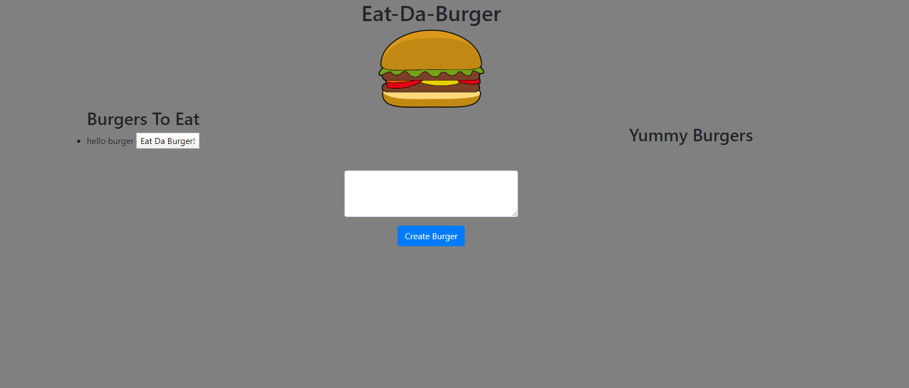

# Eat-Da-Burger

A burger logger with MySQL, Node, Express, Handlebars and Sequelize. Follows the MVC design pattern. Uses Node and MySQL to query and route data in your app, and Handlebars to generate your HTML.

# Deployed

https://pacific-earth-15388.herokuapp.com/

# Portfolio

https://dcoffey20.github.io/Portfolio/

# How To

Click on the link in the deployed section of this README. Link will take you to the page. One at a time, enter the names of burgers that you would like to eat. Click the create button to add burger to the list on the left, "Burgers To Eat". Click the "Eat Da Burger" button to eat the burger. Burger will be moved to the right list, "Yummy Burgers".

# Screenshot

